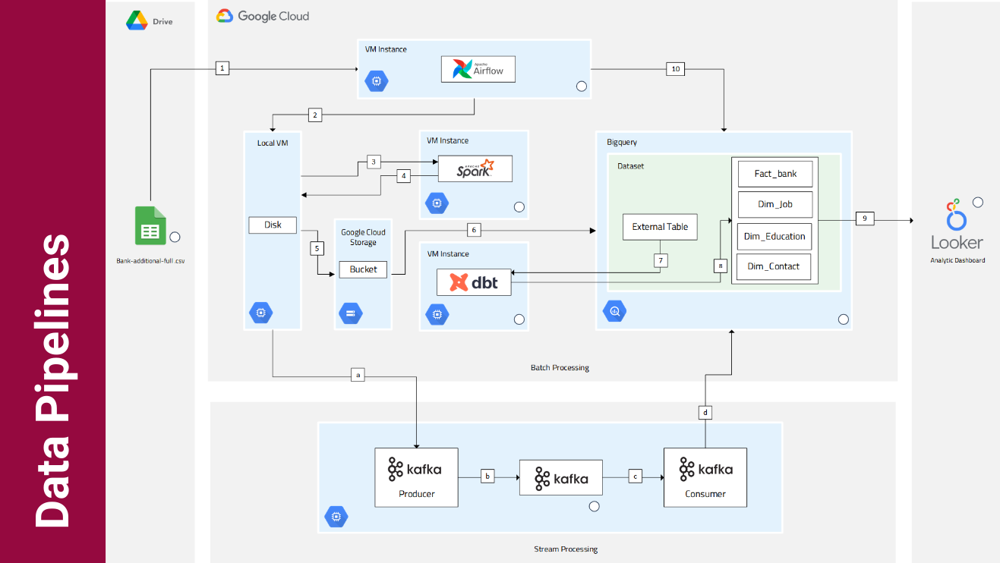
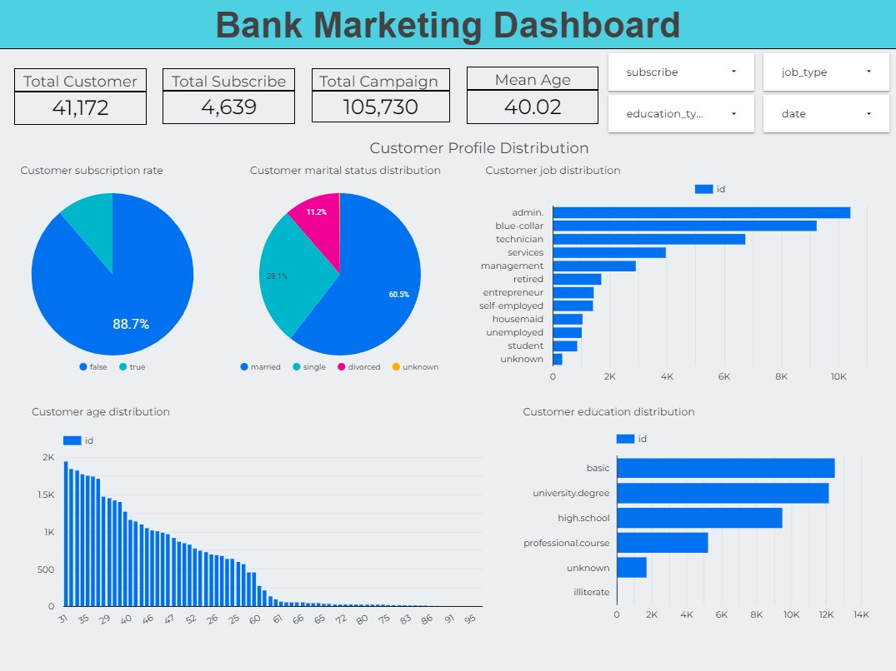
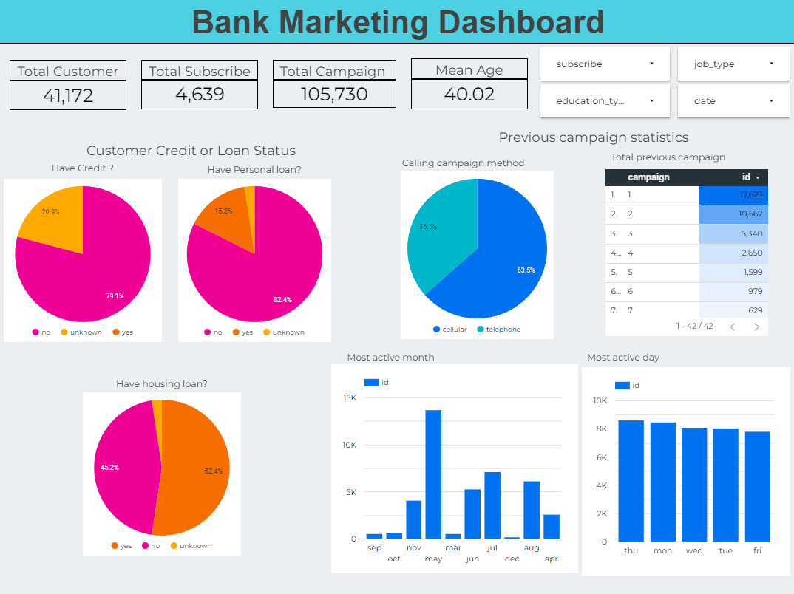

# Bank Marketing Campaign's Subscription End-to-End Data Pipeline

## Bussiness Understanding

A certain banking institution on Portugal, conducted a campaigns in order to offer a their client a term deposit. Campaign are conducted mainly based on Telemarketing method such as direct phone calls while offering their client. If after all that effort the client agreed to place deposit it will result on target variable (y) marked 'yes', otherwise 'no'. The bank-side wanted to know what kind of feature or status that make the offer more successfull in order to be more cost and time efficient, so they created this dataset in order to analyze them about historical condition of their client such as job, marital status, loan, etc and whether they agreed to place deposit.

## Problem Statements

From said back story, we can conclude that the bank want to increase the efficiency of their campaign by targeting client with higher chance of success based on the feature from the data.

## Goals

In order solve the problems, as a Data Engineer our team are proposing some objective in order to pull off that goals, as follows:

1. Design end-to-end data pipeline with Lambda Architecture, so the bussiness intellegence/analyst could choose between whether to use batched data or real time streamed data.
2. Create analytics dashboard based on data from the analytics database (data warehouse) and derive some insight from it.

## End-to-End Schema with Lambda Architecture

## Reproducibility

In order to reproduce the dependencies and overall environment used on this project refer to this guide [README.MD](https://github.com/blitzkz23/final-project-end-to-end-banking-campaign-pipeline/blob/main/src/README.MD)

## Data Visualization Dashboard

Access the dashboard [here](https://datastudio.google.com/u/0/reporting/b3ef6967-6deb-4574-a591-9444d1a99a8a/page/tEnnC)

## Google Cloud Usage Billing Report
Data infrastructure we used in this project are entirely built on Google Cloud Platform with more or less 3 weeks of project duration, 
using this following services:
- Google Cloud Storage (pay for what you use)
- Google BigQuery (first terrabyte processed are free of charge)
- Google Looker Studio (cost is based from number of Looker Blocks (data models and visualizations), users, and the number of queries processed per month)
- Pub/sub (cost is based from amount of data exchanged)
- Dataflow (cost is based on duration of processing job and number of resources utilized)
> Total cost around 51$ out of 300$ free credits that GCP provided

## Resources
[Slides and Jobdesc](https://bit.ly/FinalProject-KuliDataWarrior)

## Kelompok 5 Kuli Data Warrior
- Naufal Aldy Pradana
- Yuditya Mulia Insani
- Adrian Maulana Muhammad
- Yuda Satria Syaifi
