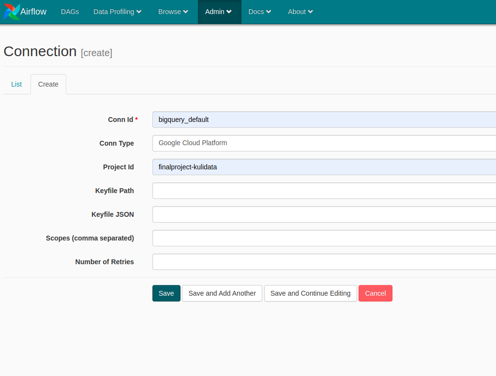

# Bank Marketing Campaign End-to-End Data Pipeline

## Bussiness Understanding

A certain banking institution on Portugal, conducted a campaigns in order to offer a their client a term deposit. Campaign are conducted mainly based on Telemarketing method such as direct phone calls while offering their client. If after all that effort the client agreed to place deposit it will result on target variable (y) marked 'yes', otherwise 'no'. The bank-side wanted to know what kind of feature or status that make the offer more successfull in order to be more cost and time efficient, so they created this dataset in order to analyze them about historical condition of their client such as job, marital status, loan, etc and whether they agreed to place deposit.

### Problem Statements

From said back story, we can conclude that the bank want to increase the efficiency of their campaign by targeting client with higher chance of success based on the feature from the data.

### Goals

In order solve the problems, as a Data Engineer our team are proposing some objective in order to pull of that goals as follows:

1. Design end-to-end data pipeline with Lambda Architecture, so the bussiness intellegence/analyst could choose between whether to use batched data or real time streamed data.
2. Create analytics dashboard based on data from the analytics database (data warehouse) and derive some insight from it.

### End-to-End Schema with Lambda Architecture


### Resources
[Slides and Jobdesc](https://bit.ly/FinalProject-KuliDataWarrior)

### Kelompok 5 Kuli Data Warrior
- Naufal Aldy Pradana
- Yuditya Mulia Insani
- Adrian Maulana Muhammad
- Yuda Satria Syaifi

### General Installation Guide/Usage

- Batch Processing
1. Clone this project
```bash
git clone https://github.com/blitzkz23/final-project-end-to-end-banking-campaign-pipeline.git
```
2. Open this project in terminal and change directory until docker-airflow folder, also build the docker file
```bash
# change directory
cd src/batch-processing/docker/docker-airflow

# run build docker
docker build --rm --build-arg AIRFLOW_DEPS="gcp" -t docker-airflow-spark:1.10.7_3.1.2 .
```
3. After docker build complete, return to previous directory and run docker compose, then wait for a few minutes for all the container to be up
```bash
docker compose up
```
4. Open the airflow webserver UI on external-IP:8282 / localhost:8282 (if you have ports forwarding)
5. Configure spark connection acessing airflow web UI http://localhost:8282 and going to Connections
   

6. Edit the spark_default connection inserting `spark://spark` in Host field and Port `7077`
    

7. Also edit the bigquery_default connection, and insert your project name:
    

8. Airflow DAGs for batch processing is ready to go! included task on the DAG are up to uploading data from gcs to BigQuery table, unfortunately the dbt transformation are not included yet on the DAGs because of the dependencies conflict.  But afraid not its simple enough, follow the next step.

9. Assuming you are still on docker directory, do:
```bash
# return to prev dir
cd ..

cd dbt

cd bank_campaign_dwh

# run dbt
dbt run
```
10. Actually you may need to configure dbt-related things before dbt run, such as defining profiles.yml and providing google-credentials.json for your own GCP project