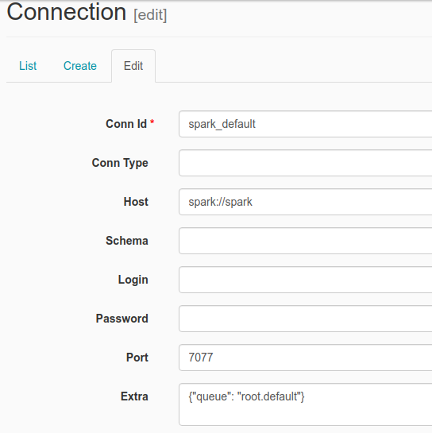

## General Installation Guide/Usage

### Batch Processing
- Prerequisite:
    A. [Python 3](https://www.python.org/downloads/)
    B. [Docker and Docker Compose](https://docs.docker.com/engine/install/ubuntu/)
    C. [Google's Credential Service Account used for GCS and Bigquery access](https://developers.google.com/workspace/guides/create-credentials)
    Rename the google credentials into `google_credentials.json` and store it in your `$HOME` directory

1. Clone this project
```bash
git clone https://github.com/blitzkz23/final-project-end-to-end-banking-campaign-pipeline.git
```
2. Open this project in terminal and change directory until docker-airflow folder, also build the docker file
```bash
# change directory
cd src/batch-processing/docker/docker-airflow

# run build docker
docker build --rm --build-arg AIRFLOW_DEPS="gcp" -t docker-airflow-spark:1.10.7_3.1.2 .
```
3. After docker build complete, return to previous directory and run docker compose, then wait for a few minutes for all the container to be up
```bash
docker compose up
```
4. Open the airflow webserver UI on external-IP:8282 / localhost:8282 (if you have ports forwarding)
5. Configure spark connection acessing airflow web UI http://localhost:8282 and going to Connections
   

6. Edit the spark_default connection inserting `spark://spark` in Host field and Port `7077`
    

7. Also edit the bigquery_default connection, and insert your project name:
    

8. Airflow DAGs for batch processing is ready to go! included task on the DAG are up to uploading data from gcs to BigQuery table, unfortunately the dbt transformation are not included yet on the DAGs because of the dependencies conflict.  But afraid not its simple enough, follow the next step.

9. You need to set up few dbt-related config, such as:
- Create profiles.yml on ~/.dbt or /home/usr/.dbt directory.  Refer to this [example](https://docs.getdbt.com/reference/profiles.yml)
- Generate google-credentials.json from service account that have accesss to bigquery
10. Assuming you are still on docker directory, do:
```bash
# return to prev dir
cd ..

cd dbt

cd bank_campaign_dwh

# run dbt
dbt run